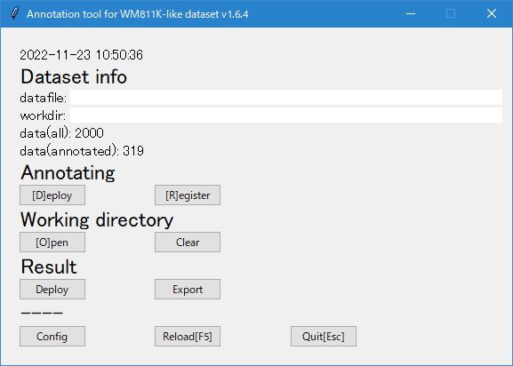

# Annotation tool for WM-811K-like dataset

- WM-811Kライクなデータセット
  (1チャンネル2次元の画像(numpy.ndarray)を含む、DataFrameのPickleファイル)
  用のアノテーションツールです。
- ファイルマネージャ(エクスプローラ)上で
  **画像ファイルをディレクトリに振り分け、**
  振り分けた結果をデータセットに登録していくことでアノテーションを行います。


## 使い方

### 基本手順

1. Deploy: 画像データが含まれるPickleファイル(DataFrame)をロードし、
  アノテーション対象画像とラベル名のディレクトリ、および見本画像を
  作業ディレクトリに展開する。
1. アノテーション作業: 作業ディレクトリの画像をラベル名のディレクトリに振り分ける。
  必要に応じて、新規ラベル(ディレクトリ)を作成する。
1. Register: アノテーション作業の結果をDataFrameのラベル列に登録し、
  Pickleファイルに保存する。

### GUIで実行する

※Windows専用



- `annotation.bat` を実行する。
- 「Deploy」ボタンまたは「D」キーで、Deploy。
- 「Open」ボタンまたは「O」キーで作業ディレクトリを開く。
- 「Register」ボタンまたは「R」キーで、Register。

### コマンドで実行する

```sh
# Deploy
python -m annotation -d

# Register
python -m annotation -r
```

```
optional arguments:
  -h, --help            show this help message and exit
  --gui, -g
  --deploy, -d
  --register, -r
  --deploy-result       Deploy results (all annotated images)
  --export EXPORT       Export results to a CSV file
  --create-config-file  Create default configuration file
  --create-sample-datafile
                        Create sample datafile (sample.pkl.xz)
  --file FILE, -f FILE  Pickled pandas.DataFrame file path
  --workdir WORKDIR, -w WORKDIR
                        Working directory path
  --config-file CONFIG_FILE
                        Configuration file path
  --cmap-file CMAP_FILE
                        Custom matplotlib.cmap file (JSON)
  --config-section CONFIG_SECTION
                        Configuration section name
  --verbose, -v
  --version, -V         show program's version number and exit
```

```sh
# 全てのアノテーション済み画像のみ出力する
python -m annotation --deploy-result
```

```sh
# アノテーション結果をCSVファイルに出力する
python -m annotation --export result.csv
```

```sh
# サンプルdatafile sample.pkl.xz を生成する
# (カラム設定は config.ini に従う)
python -m annotation --create-sample-datafile
```

### 備考

- ラベル列はstrに変換されます。
- ラベル列が元のDataFrameに存在しなければ、作成します。
- 1枚の画像に対し付与できるラベルは1つだけです。
- 新規ディレクトリを作成すれば、それが新規ラベルになります。
- 空文字列をラベルとして使うことはできません。
- [自作カラーマップ](#自作カラーマップ) を定義できます。
- deploy/registerの度に、
  workdir (デフォルトでは `./work`) を
  `shutil.rmtree(workdir)` で空にします。
  workdirにはアノテーション作業用データ以外を置かないでください。
- Register時、元のPickleファイルをバックアップとしてコピーして保存します。
  (デフォルトでは `./data.pkl.xz~`)
- Pickleファイルを読んでPickleファイルに戻すので、
  ファイルサイズが大きい場合は動作が遅くなります。

## datafile

- pandas.DataFrame
- 必要なカラム
  - ID(col_filename)列
  - 画像(col_img)列
  - ラベル(col_label)列 ※なければ作成されます。
- 画像は2次元numpy.ndarray

**Example:**

```python
>>> import pandas as pd
>>> df = pd.read_pickle("./data.pkl.xz")
>>> df.loc[0, col_img]

array([[0.60988542, 0.06832986, 0.7105369 , 0.52975455],
       [0.146365  , 0.37815561, 0.74161512, 0.65022729],
       [0.55001124, 0.64548976, 0.59598189, 0.15400786],
       [0.88276608, 0.20265346, 0.52643172, 0.3005652 ]])
```

## config.ini

設定ファイル

- 設定ファイルは、なくてもOKです。
- デフォルト値から変更しない行は、省略してもOKです。
- datafile, workdir は
  コマンドラインオプションでも指定できます。
  両方指定した場合は、コマンドラインオプションの値が使われます。
- `--config-file` オプションで任意のファイルを指定できます。
- セクションはデフォルトではannotationを使います。
  `--config-section` オプションで変更できます。

```sh
# デフォルト設定の設定ファイルを生成する
python -m annotation --create-config-file
```

```ini
[annotation]
; Pickled pandas.DataFrame file path
datafile = ./data.pkl.xz
; Working directory path
workdir = ./work
; custom colormap
; (nullable)
cmapfile =
; Number of images to annotate at once
; (nullable) If null, deploy all images.
n = 30
; Number of example images of each label
; (nullable) If null, deploy all images.
n_example = 5
; Column name for image-file name
col_filename = id
; Column name of image (containing numpy.ndarray)
col_img = img
; Column name of label
col_label = label
; List of initial labels (comma-separated)
; (nullable) If null, no initial labels set.
labels = none
; String representing to be unannotated
; (nullable) If null, "" represens to be unannotated.
label_null = 
; 1=Select randomly, 0=order by index
random = 1
; Image file extension
imgext = .png
; colormap name
; (nullable) If null, use seaboarn.heatmap-default cmap.
cmap = 
; seaborn.heatmap.vmin
; (nullable) If null, determined automatically.
vmin = 0.0
; seaborn.heatmap.vmax
; (nullable) If null, determined automatically.
vmax = 1.0
; matplotlib.pyplot.figure.figsize
figsize = 4,4
; 1=Copy datafile to datafile~ before save
backup = 1
; 1=Print verbose messages
verbose = 0
```

### WM-811Kで使う

```ini
[DEFAULT]
datafile = LSWMD.pkl
col_filename = index
col_img = waferMap
col_label = failureType
labels = 
label_null = []
cmap = coolwarm
vmin =
vmax =
```

[kaggle - WM-811K wafer map](https://www.kaggle.com/datasets/qingyi/wm811k-wafer-map)
(License: CC0)


## 自作カラーマップ

- カスタムマップを定義する方法は2種類あります。
  - (推奨)JSONファイルにカラーマップ定義を記入する。
    (サンプル: [cmap_sample.json](doc/cmap_sample.json))
  - [cmap.py](annotation/cmap.py) に直接記入しても構いません。

## LICENSE

[LICENSE](LICENSE)

## CHANGELOG

[CHANGELOG.md](CHANGELOG.md)
