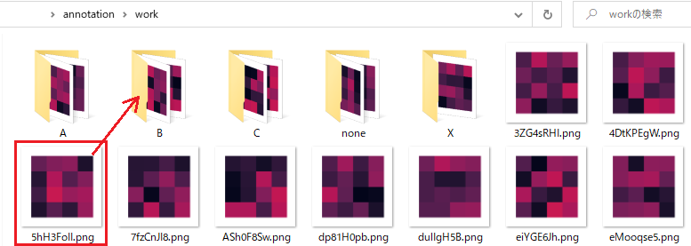
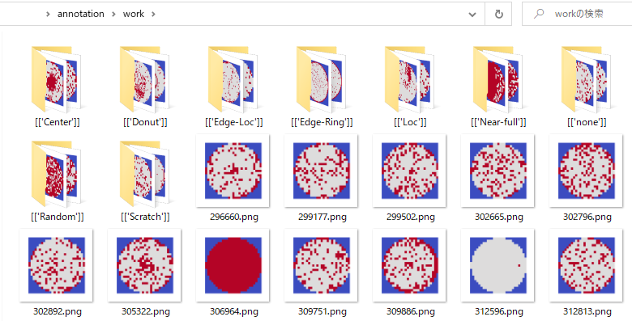

# 簡易アノテーションツール

1チャンネル2次元の画像(numpy.ndarray)を含むデータセット
(Pickleファイル、pandas.DataFrame。WM-811Kライク)を読み込み、
アノテーションするためのツール。

アノテーション作業自体はファイルマネージャ上で
**画像ファイルをディレクトリに振り分ける**
ことで行う。



## 機能

- Deploy: 画像データが含まれるPickleファイル(DataFrame)をロードし、
  アノテーション作業ディレクトリを生成する。
- Register: アノテーション(ディレクトリ振分け)した結果をDataFrameのラベル列に登録し、
  Pickleファイルに保存する。

## 使い方

```sh
# 1. アノテーション対象画像を作業ディレクトリにデプロイ
python -m annotation -d

# 2. アノテーション作業
#   * 画像ファイルをラベルディレクトリに振り分ける。
#   * 新規ラベル(ディレクトリ)を生成してもOK。

# 3. アノテーション結果をdatafile(Pickle)に登録
python -m annotation -r
```

### arguments

```
optional arguments:
  -h, --help            show this help message and exit
  --deploy, -d
  --register, -r
  --verbose, -v
  --file FILE, -f FILE  Datafile(Pickle)
  --workdir WORKDIR, -w WORKDIR
                        Working directory
  --makesample MAKESAMPLE
                        Make sample datafile (number)
```

### 備考

- ラベル列はstrに変換されます。
- ラベル列が元のDataFrameに存在しなければ、作成します。
- 1枚の画像に対し付与できるラベルは1つだけです。
- 新規ディレクトリを作成すれば、それが新規ラベルになります。
- 空文字列をラベルとして使うことはできません。
- 自作カラーマップを使用できます。 -> [cmap.py](#cmappy)
- deploy/registerの度に、
  workdir (デフォルトでは `./work`) を
  `shutil.rmtree(workdir)` で空にします。
  workdirにはアノテーション作業用データ以外を置かないでください。

## datafile

- pandas.DataFrame
- 必要なカラム
  - ID(col_filename)列
  - 画像(col_img)列
  - ラベル(col_label)列 ※なければ作成されます。
- 画像は2次元numpy.ndarray

**Example:**

```python
>>> import pandas as pd
>>> df = pd.read_pickle("./data.pkl.xz")
>>> df.loc[0, col_img]

array([[0.60988542, 0.06832986, 0.7105369 , 0.52975455],
       [0.146365  , 0.37815561, 0.74161512, 0.65022729],
       [0.55001124, 0.64548976, 0.59598189, 0.15400786],
       [0.88276608, 0.20265346, 0.52643172, 0.3005652 ]])
```

### サンプルdatafile生成

`sample.pkl.xz`
を生成します。

```sh
python -m annotation --makesample 100
```

## config.ini

[config.ini](config.ini)

全ての項目を記載する必要はなく、
変更したい項目のみでOK。

```ini
[DEFAULT]
datafile = ./data.pkl.xz
; Working directory
workdir = ./work
; Number of images to annotate at once
n = 30
; Number of example images of each label
n_example = 5
; Column name for image-file name
col_filename = id
; Column name of image (numpy.ndarray)
col_img = img
; Column name of label
col_label = label
; List of initial labels (comma-separated) *nullable
labels = A,B,C,none
; String representing "not annotated yet" *nullable
label_null = 
; 1=Select randomly, 0=order by index
random = 1
; Image file extension
imgext = .png
; matplotlib.cmap (you can use custom cmap name in cmap.py) *nullable
cmap = 
; seaborn.heatmap.vmin *nullable
vmin = 0.
; seaborn.heatmap.vmax *nullable
vmax = 1.
; 1=print verbose messages
verbose = 0
```

### WM-811Kで使う

```ini
[DEFAULT]
datafile = LSWMD.pkl
col_filename = index
col_img = waferMap
col_label = failureType
labels = 
label_null = []
cmap = coolwarm
vmin =
vmax =
```

[kaggle - WM-811K wafer map](https://www.kaggle.com/datasets/qingyi/wm811k-wafer-map)
(License: CC0)



## cmap.py

[cmap.py](annotation/cmap.py)

自作カラーマップを定義できます。

## LICENSE

[LICENSE](LICENSE)

## CHANGELOG

[CHANGELOG.md](CHANGELOG.md)
